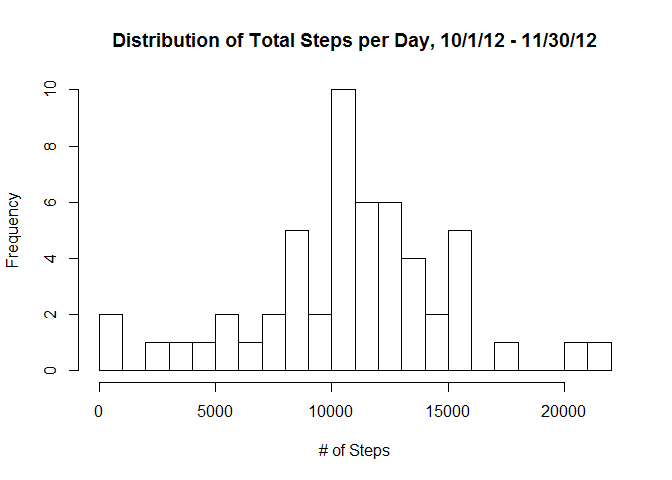
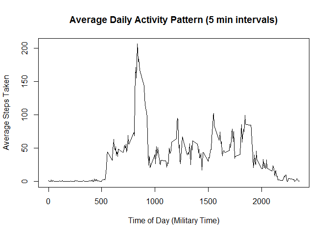
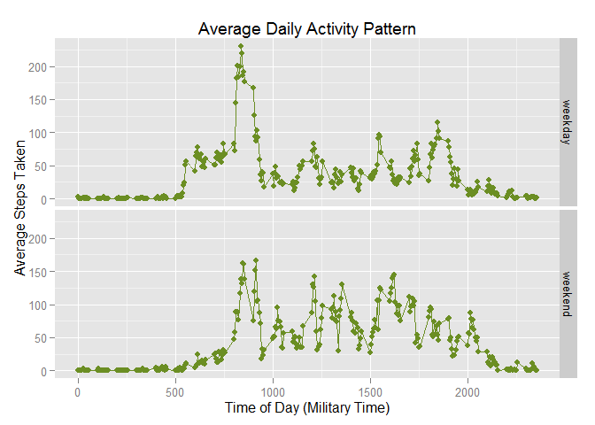

# Reproducible Research: Peer Assessment 1


## Loading and preprocessing the data

The variables included in this dataset are:
    steps: Number of steps taking in a 5-minute interval (missing values are coded as NA)
    date: The date on which the measurement was taken in YYYY-MM-DD format
    interval: Identifier for the 5-minute interval in which measurement was taken


```r
data <- read.csv("activity.csv")
str(data) ##loading data and showing structure
```

```
## 'data.frame':	17568 obs. of  3 variables:
##  $ steps   : int  NA NA NA NA NA NA NA NA NA NA ...
##  $ date    : Factor w/ 61 levels "2012-10-01","2012-10-02",..: 1 1 1 1 1 1 1 1 1 1 ...
##  $ interval: int  0 5 10 15 20 25 30 35 40 45 ...
```

## What is mean total number of steps taken per day?


```r
steps <- aggregate(data$steps, list(data = data$date), sum)
hist(steps$x, 
     breaks = 30,
     main = "Distribution of Total Steps per Day, 10/1/12 - 11/30/12",
     xlab = "# of Steps",
     ylab = "Frequency")
```

 

```r
mean1 <- mean(steps$x, na.rm = TRUE) ## Mean total steps per day
mean1
```

```
## [1] 10766.19
```

```r
median1 <- median(steps$x, na.rm = TRUE) ## Median total steps per day
median1
```

```
## [1] 10765
```
    
## What is the average daily activity pattern?


```r
interval <- aggregate(data$steps, list(data = data$interval), mean, na.rm = TRUE)
plot(interval$data, interval$x, type = "l",
     main = "Average Daily Activity Pattern (5 min intervals)",
     xlab = "Time of Day (Military Time)",
     ylab = "Average Steps Taken")
```

 

```r
maxinterval <- interval[which.max(interval[,2]),]
maxinterval[,1]    ## 5 minute time interval with the most average steps
```

```
## [1] 835
```

## Imputing missing values

There are many missing rows, so we attempt to imput the missing values. Logic for imputing missing values: if stepcount for a given row is NA, replace it in the mean step count for that 5-minute interval (as calculated in the previous section).


```r
sum(is.na(data$steps)) ## Total number of rows with missing data
```

```
## [1] 2304
```

```r
## Iterate over each row of the dataset to replace NA values
for (i in 1:length(data$steps)) {                                
    if (is.na(data[i,1])) {
       a <- data[i,3] ## find the interval value for the missing row
       b <- interval[interval$data == a,] ## find the mean to match that interval value
       data[i,1] = b[,2] ##replace the NA value
       }
}
 
data2 <- data ## new dataset with filled in missing values
data <- read.csv("activity.csv") ## reset original dataframe

steps2 <- aggregate(data2$steps, list(data2 = data2$date), sum)
hist(steps2$x, 
     breaks = 30,
     main = "Distribution of Total Steps per Day, NAs imputed",
     xlab = "# of Steps",
     ylab = "Frequency")
```

 

Due to our logic, the mean stays the same as in the original data set, but the median changes slightly.


```r
mean2 <- mean(steps2$x, na.rm = TRUE) ## New mean total steps per day
mean2
```

```
## [1] 10766.19
```

```r
median2 <- median(steps2$x, na.rm = TRUE) ## New median total steps per day
median2
```

```
## [1] 10766.19
```

```r
meandifference <- mean1 - mean2
meandifference ## what is the difference between the means from the first and second data sets?
```

```
## [1] 0
```

```r
mediandifference <- median1 - median2
mediandifference ## what is the difference between the medians from the first and second data sets?
```

```
## [1] -1.188679
```

## Are there differences in activity patterns between weekdays and weekends?


```r
data2$weektype <- weekdays(as.Date(data2$date)) ## add column for weekday vs. weekend

for (i in 1:length(data2$weektype)) {                                
    if (data2[i,4] == "Saturday" || data2[i,4] == "Sunday") {
        data2[i,4] <- "weekend"
    } else {
        data2[i,4] <- "weekday"
    }
}

data2$weektype <- as.factor(data2$weektype) ## convert new column to factor

## subsetting original data to calculate means for weekday and weekends, then recombining with rbind
onlyweekdays <- data2[data2$weektype == "weekday",]
onlyweekends <- data2[data2$weektype == "weekend",]
weekdayavg <- aggregate(onlyweekdays$steps, list(data = onlyweekdays$interval), mean)
weekdayavg$weektype <- "weekday"
weekendavg <- aggregate(onlyweekends$steps, list(data = onlyweekends$interval), mean)
weekendavg$weektype <- "weekend"
intervals2 <- rbind(weekdayavg, weekendavg)

library(ggplot2) ## using ggplot for the panel plot!
g <- ggplot(intervals2, aes(data,x)) + 
    geom_line(color = "olivedrab") + 
    geom_point(color = "olivedrab") +
    xlab("Time of Day (Military Time)") + 
    ylab("Average Steps Taken") +
    ggtitle("Average Daily Activity Pattern") + 
    facet_grid(weektype ~ .) 
g
```

 
